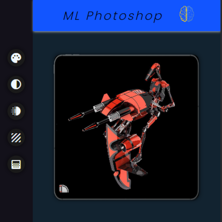
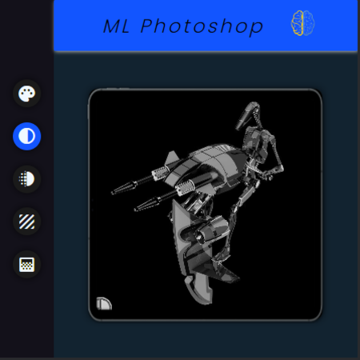
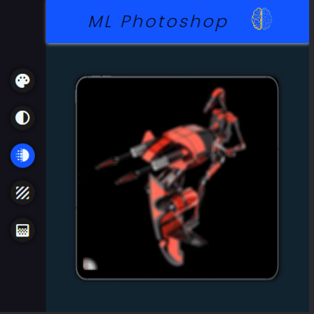
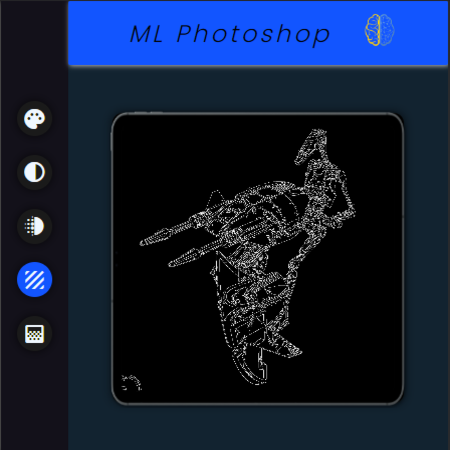
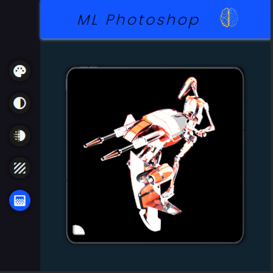

# ML-Photoshop-Web-App
a machine learning web app that uses OpenCV to perform minimal photoshop operations.

## SCREEN SHOTS

### Original image  
  

### Grayscaled image  
  

### Blurred image  
  

### Canny image 
  

### Filtered image  
  